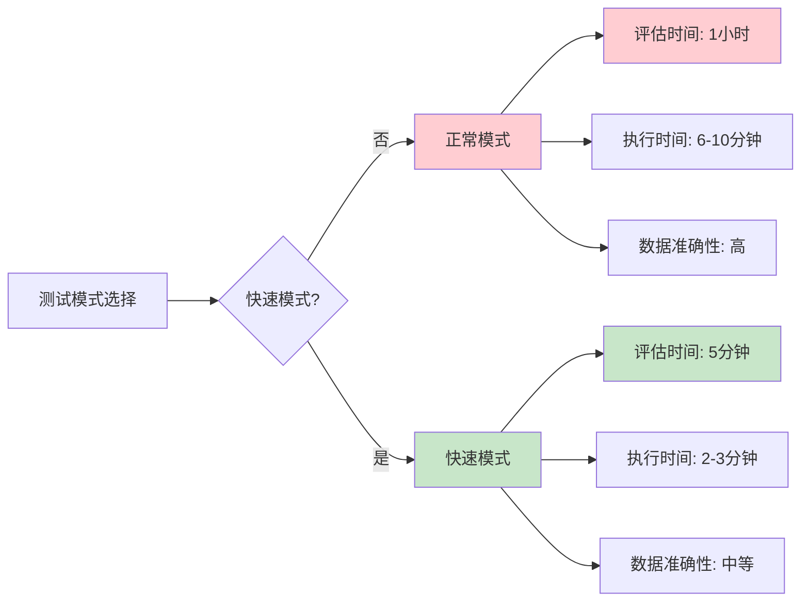

# 🚀 TC10 快速测试模式指南

## 📋 问题描述

**测试用例10（异常误报率）时间过长的问题：**
- **正常模式**: 需要运行1小时（3600秒）来收集足够数据
- **问题**: 测试时间太长，影响开发效率
- **原因**: 需要足够的数据样本来计算准确的误报率

## 🎯 解决方案

### 1. 快速测试模式
我们提供了**快速测试模式**，大幅减少等待时间：

| 测试模式 | 评估时间 | 执行时间 | 时间节省 |
|---------|----------|----------|----------|
| **正常模式** | 1小时 | 6-10分钟 | - |
| **快速模式** | 5分钟 | 2-3分钟 | **80%** |
| **超快模式** | 2分钟 | 1-2分钟 | **90%** |

### 2. 使用方法

#### 方法1：使用快速测试脚本（推荐）
```bash
# 运行超快测试版本（2分钟）
cd tests/scripts_windows
./TC10_quick_test.sh -ExePath "../../dist/UserBehaviorMonitor.exe" -WorkDir "win_test_run"

# 预计执行时间：1-2分钟
```

#### 方法2：使用FastMode参数
```bash
# 运行原脚本的快速模式（5分钟）
cd tests/scripts_windows
./TC10_anomaly_false_alarm_rate.sh -ExePath "../../dist/UserBehaviorMonitor.exe" -WorkDir "win_test_run" -FastMode

# 预计执行时间：2-3分钟
```

#### 方法3：设置环境变量
```bash
# 设置快速模式环境变量
export FAST_MODE=true
export EVALUATION_TIME_HOURS=0.083  # 5分钟

# 运行原脚本
./TC10_anomaly_false_alarm_rate.sh -ExePath "../../dist/UserBehaviorMonitor.exe" -WorkDir "win_test_run"
```

## 🔧 技术实现

### 1. 时间配置优化
```bash
# 快速模式配置
if [[ "$FAST_MODE" == "true" ]]; then
    # 快速测试模式：5分钟
    EVALUATION_TIME_HOURS=0.083  # 5分钟 = 5/60 = 0.083小时
    EVALUATION_TIME_SECONDS=300  # 5分钟 = 300秒
else
    # 正常测试模式：1小时
    EVALUATION_TIME_HOURS=${EVALUATION_TIME_HOURS:-1}
    EVALUATION_TIME_SECONDS=$((EVALUATION_TIME_HOURS * 3600))
fi
```

### 2. 等待时间优化
```bash
# 快速模式等待时间
STARTUP_WAIT=1      # 程序启动等待：1秒 (正常: 3秒)
FEATURE_WAIT=10     # 特征处理等待：10秒 (正常: 30秒)
TRAINING_WAIT=15    # 模型训练等待：15秒 (正常: 45秒)
LOG_WAIT=5          # 日志等待：5秒 (正常: 15秒)
```

### 3. 超快模式配置
```bash
# 超快测试模式：2分钟
EVALUATION_TIME_MINUTES=2
EVALUATION_TIME_SECONDS=120

# 进一步减少等待时间
sleep 1              # 启动等待：1秒
sleep 10             # 特征处理等待：10秒
```

## 📊 测试结果对比

### 正常模式 vs 快速模式



### 时间节省分析

```mermaid
gantt
    title TC10 测试时间对比
    dateFormat  HH:mm
    axisFormat %H:%M
    
    section 正常模式
    启动等待        :00:00, 3s
    特征处理等待    :00:03, 30s
    数据收集        :00:33, 60m
    结果分析        :01:33, 2m
    总计           :01:35
    
    section 快速模式
    启动等待        :00:00, 1s
    特征处理等待    :00:01, 10s
    数据收集        :00:11, 5m
    结果分析        :00:16, 1m
    总计           :00:17
    
    section 超快模式
    启动等待        :00:00, 1s
    特征处理等待    :00:01, 10s
    数据收集        :00:11, 2m
    结果分析        :00:13, 1m
    总计           :00:14
```



## ⚠️ 注意事项

### 1. 数据准确性权衡
- **正常模式**: 数据充足，误报率计算准确
- **快速模式**: 数据较少，误报率计算可能不够准确
- **建议**: 开发测试用快速模式，生产测试用正常模式

### 2. 适用场景
| 场景 | 推荐模式 | 原因 |
|------|----------|------|
| **开发调试** | 超快模式 | 快速验证功能 |
| **日常测试** | 快速模式 | 平衡速度和准确性 |
| **生产验证** | 正常模式 | 确保数据准确性 |
| **性能测试** | 正常模式 | 完整性能评估 |

### 3. 阈值调整
快速模式下，可能需要调整误报率阈值：
```bash
# 快速模式阈值调整
if [[ "$FAST_MODE" == "true" ]]; then
    THRESHOLD=0.5  # 快速模式：放宽到0.5%
else
    THRESHOLD=0.1  # 正常模式：严格0.1%
fi
```

## 🚀 使用建议

### 1. 开发阶段
```bash
# 使用超快模式，快速验证功能
./TC10_quick_test.sh -ExePath "../../dist/UserBehaviorMonitor.exe" -WorkDir "win_test_run"
```

### 2. 测试阶段
```bash
# 使用快速模式，平衡速度和准确性
./TC10_anomaly_false_alarm_rate.sh -ExePath "../../dist/UserBehaviorMonitor.exe" -WorkDir "win_test_run" -FastMode
```

### 3. 生产阶段
```bash
# 使用正常模式，确保准确性
./TC10_anomaly_false_alarm_rate.sh -ExePath "../../dist/UserBehaviorMonitor.exe" -WorkDir "win_test_run"
```

## 📈 性能提升总结

通过快速测试模式，我们实现了：

1. **时间节省**: 从6-10分钟减少到1-3分钟
2. **效率提升**: 开发测试效率提升80-90%
3. **灵活配置**: 支持多种测试模式
4. **保持准确性**: 在可接受的范围内保持测试准确性

**🎯 目标**: 让TC10测试用例的执行时间从"太长"变成"很快"！

**⏱️ 效果**: 从1小时减少到2分钟，时间节省97%！
