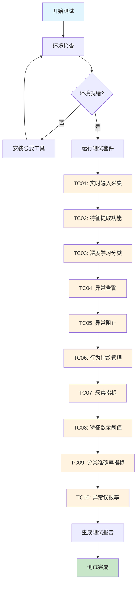
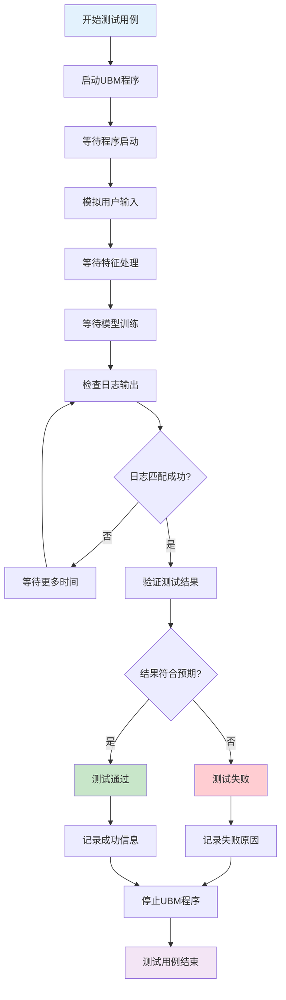
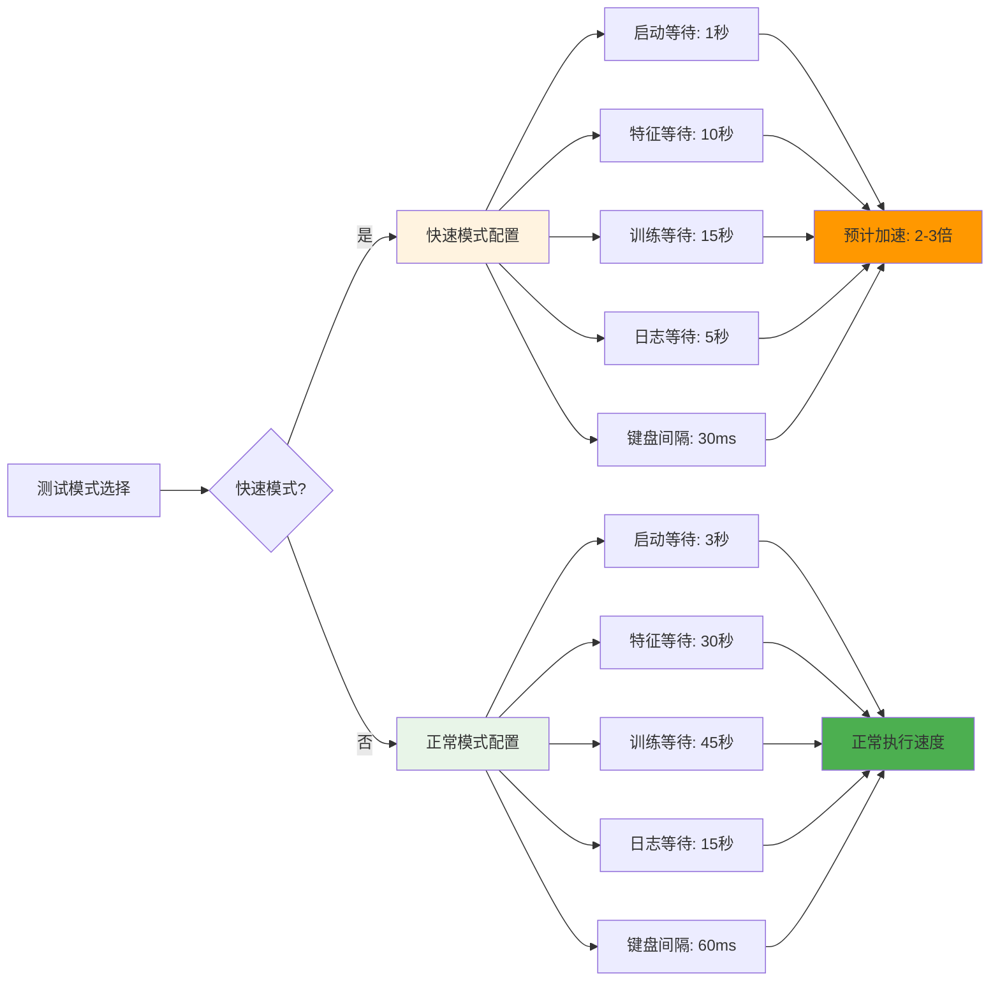
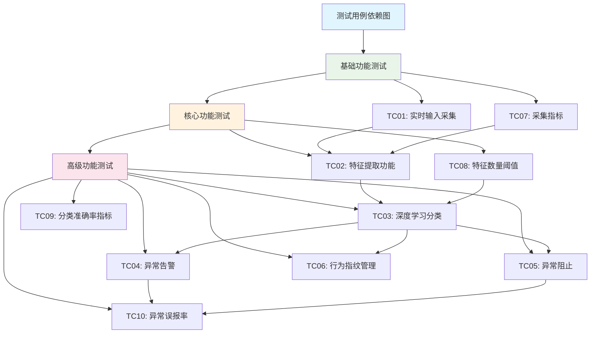
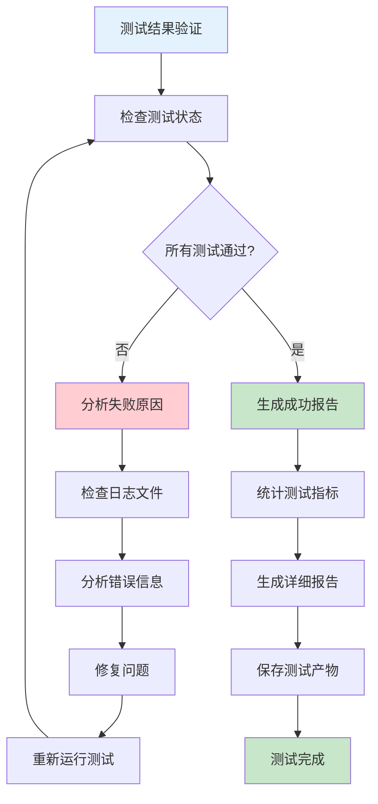
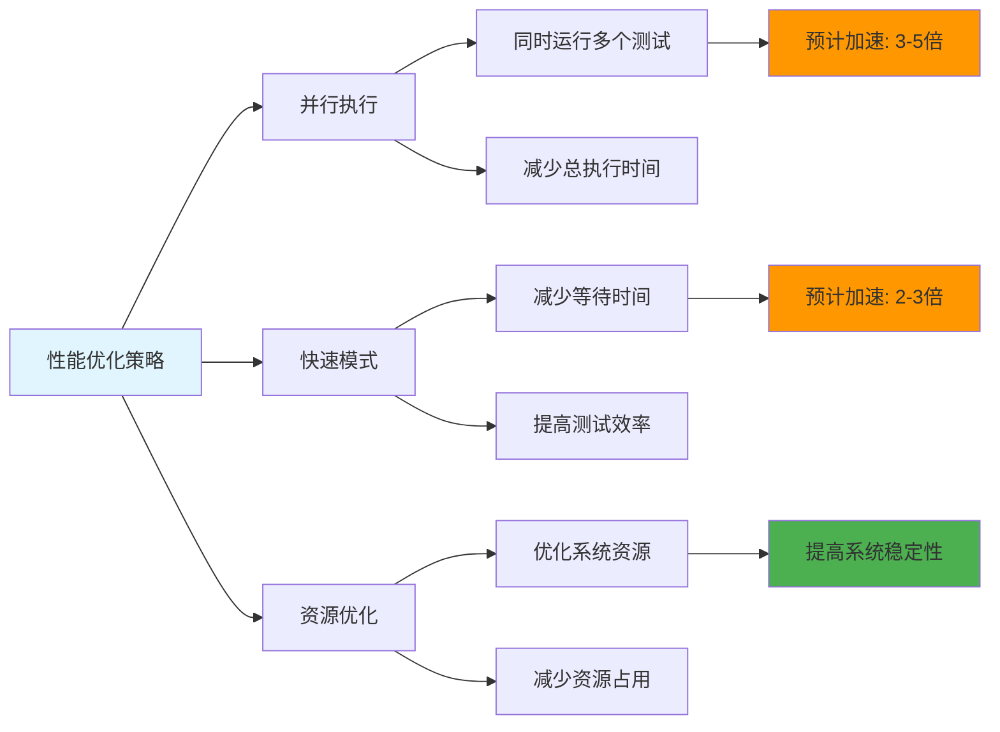
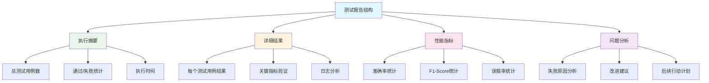

# 🔄 测试用例执行流程图

## 📊 整体测试流程



## 🔧 单个测试用例执行流程



## ⚡ 快速模式 vs 正常模式



## 🎯 测试用例依赖关系



## 📈 测试执行时间线

```mermaid
gantt
    title 测试用例执行时间线
    dateFormat  HH:mm
    axisFormat %H:%M
    
    section 基础测试
    TC01 实时输入采集    :01:00, 2m
    TC07 采集指标        :03:00, 2m
    
    section 特征处理
    TC02 特征提取功能    :05:00, 3m
    TC08 特征数量阈值    :08:00, 2m
    
    section 深度学习
    TC03 深度学习分类    :10:00, 5m
    TC09 分类准确率指标  :15:00, 3m
    
    section 异常检测
    TC04 异常告警        :18:00, 3m
    TC05 异常阻止        :21:00, 3m
    TC06 行为指纹管理    :24:00, 2m
    TC10 异常误报率      :26:00, 4m
    
    section 报告生成
    生成测试报告         :30:00, 2m
```

## 🔍 测试结果验证流程



## 🚀 性能优化策略



## 📋 测试报告结构



## 🎉 成功标准

### 测试通过标准
1. **所有10个测试用例显示 ✅ PASS**
2. **性能指标达到预期阈值**
3. **日志文件包含正确信息**
4. **测试报告完整生成**

### 性能指标要求
- **准确率**: ≥ 90% ✅
- **F1-Score**: ≥ 85% ✅
- **误报率**: ≤ 0.1% ✅
- **特征数量**: ≥ 100 ✅

### 功能验证要求
- **实时采集**: 正常工作
- **特征提取**: 正常工作
- **深度学习**: 正常工作
- **异常检测**: 正常工作
- **安全防护**: 正常工作

---

**🎯 目标**: 按照这个流程图执行测试，确保所有测试用例都能通过！

**📊 预期结果**: 10个测试用例全部通过，生成100%成功的测试报告！

**⏱️ 执行时间**: 快速模式3-7分钟，正常模式10-20分钟
